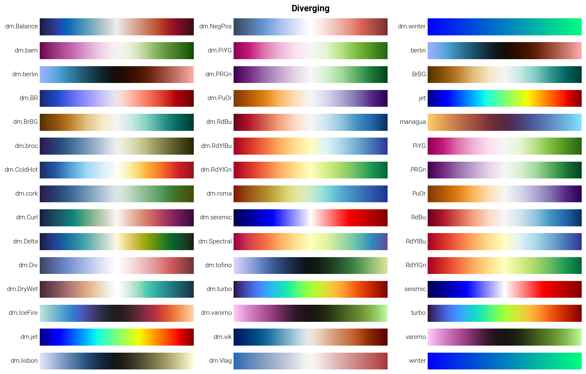
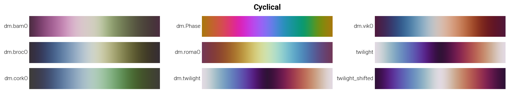
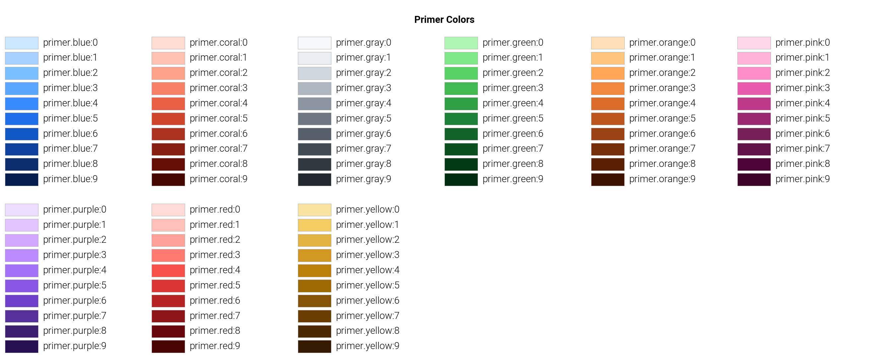
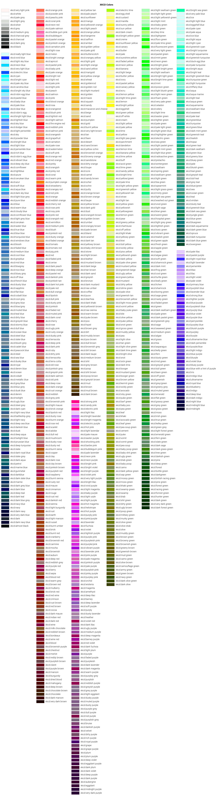

# Color and Colormap Gallery

This document provides visual samples of all available colors and colormaps in dartwork-mpl. These images are generated from `plot_colormaps()` and `plot_colors()` functions.

## Colormaps

Colormaps are organized by type. Each category shows all available colormaps with their names.

### Sequential Single-Hue

Sequential colormaps that use a single hue with varying lightness.


### Sequential Multi-Hue

Sequential colormaps that use multiple hues.


### Diverging

Diverging colormaps that have distinct middle values and different colors at the ends.



### Cyclical

Cyclical colormaps that start and end with similar colors, suitable for periodic data.



### Categorical

Categorical colormaps with distinct colors for different categories.


## Colors

Colors are organized by library. Each library shows all available named colors with their names.

### OpenColor

OpenColor color palette.


### Tailwind (tw)

Tailwind CSS color palette. Colors are named with the format `tw.{color}:{weight}` (e.g., `tw.blue:500`).


### Material Design (md)

Material Design color palette. Colors are named with the format `md.{color}:{weight}` (e.g., `md.blue:500`).


### Ant Design (ant)

Ant Design color palette. Colors are named with the format `ant.{color}:{weight}` (e.g., `ant.blue:5`).


### Chakra UI (chakra)

Chakra UI color palette. Colors are named with the format `chakra.{color}:{weight}` (e.g., `chakra.blue:500`).


### Primer (primer)

Primer color palette. Colors are named with the format `primer.{color}:{weight}` (e.g., `primer.blue:5`).



### Other Colors

Other named colors from matplotlib and dartwork-mpl.


### XKCD Colors

XKCD color survey colors. These are named colors from the XKCD color survey.



## Regenerating Images

To regenerate these images, run the `generate_gallery.py` script:

```bash
python docs/generate_gallery.py
```

The script will generate PNG images in the `docs/images/` directory. Make sure you have dartwork-mpl installed and all dependencies are available.

