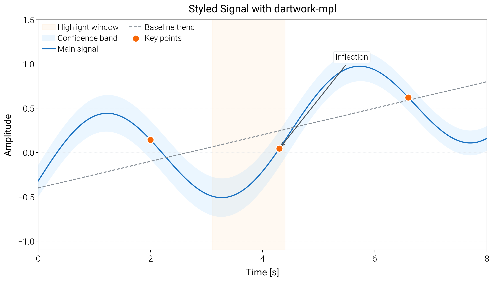
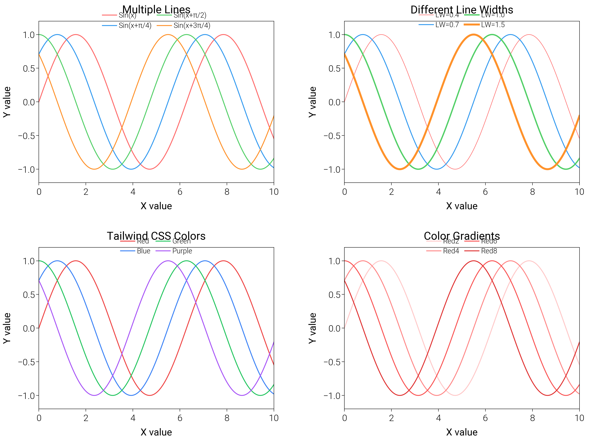
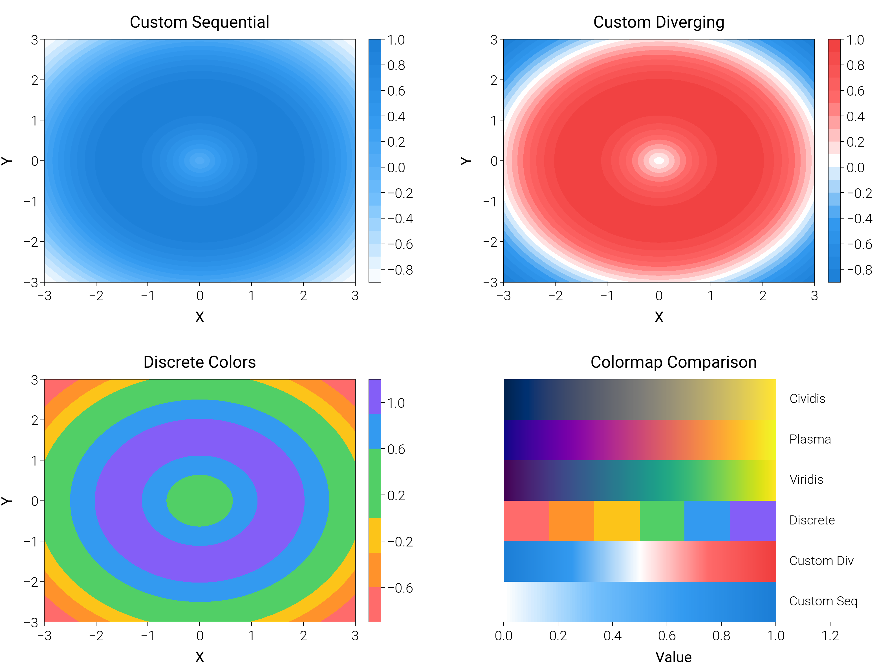
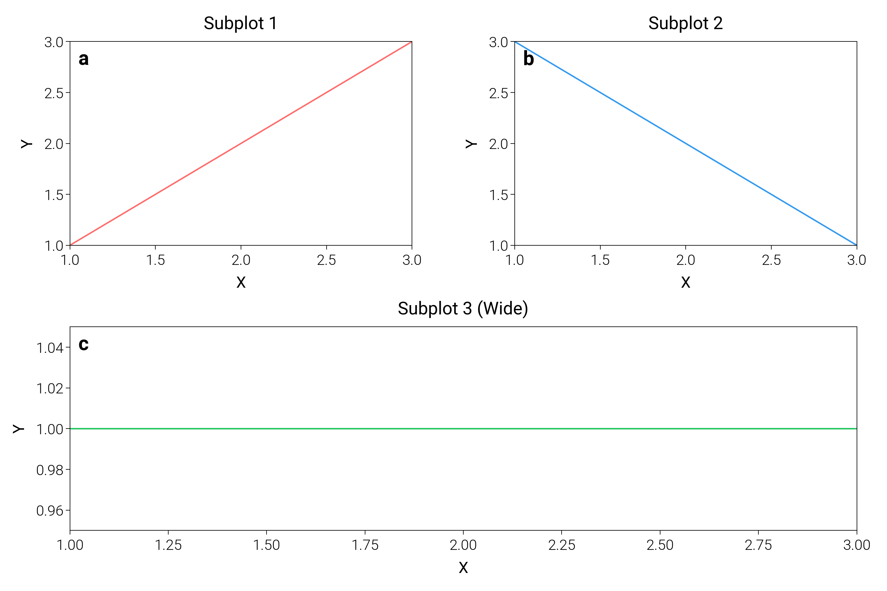
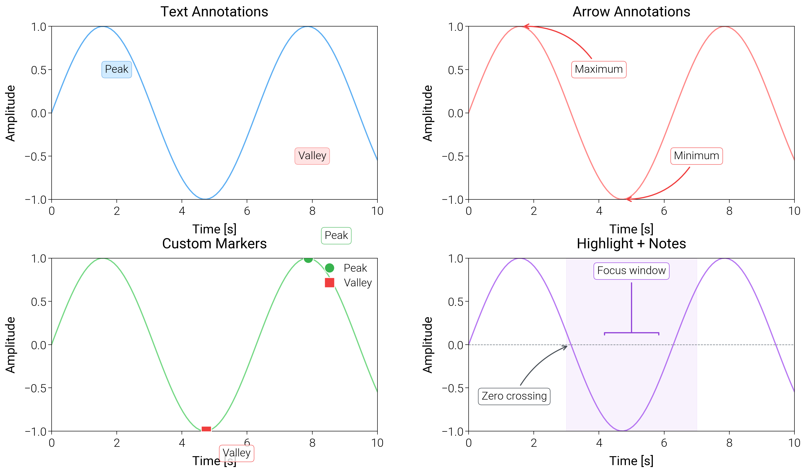
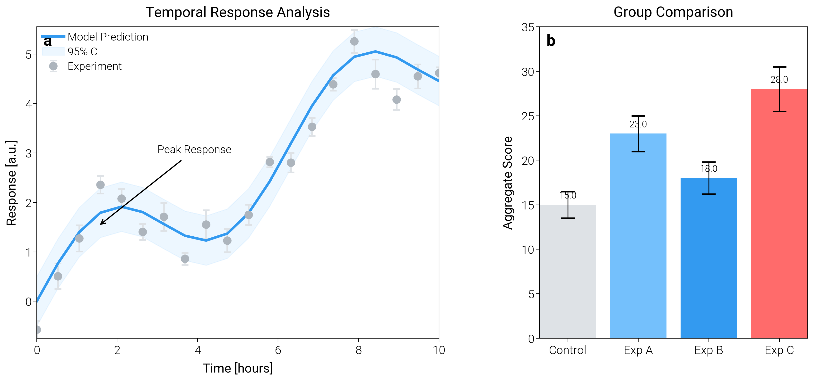
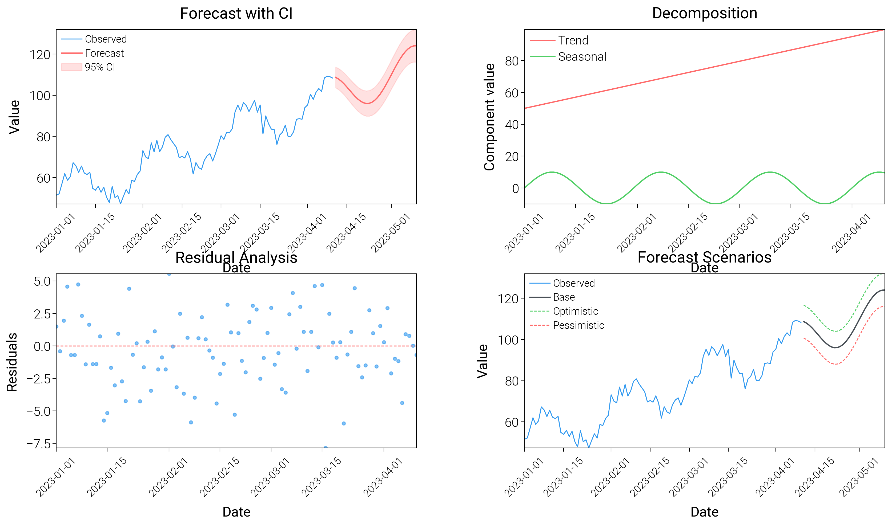

# Usage Guide

dartwork-mpl ships opinionated matplotlib styles, curated color libraries, and layout helpers so you can assemble publication-quality figures quickly. Every snippet below is real, and each one is paired with a representative plot from the gallery so you can see what the code produces.

## 1. Style the plot first
```python
import numpy as np
import matplotlib.pyplot as plt
import dartwork_mpl as dm

dm.style.use_preset("scientific")  # or: presentation, investment, scientific-kr, ...

x = np.linspace(0, 10, 200)
fig, ax = plt.subplots(figsize=(dm.cm2in(9), dm.cm2in(7)), dpi=300)
ax.plot(x, np.sin(x), lw=0.8, label="Sin", color="dm.red5")
ax.plot(x, np.cos(x), lw=0.8, label="Cos", color="dm.blue5")
ax.set_xlabel("Time [s]", fontsize=dm.fs(0))
ax.set_ylabel("Amplitude", fontsize=dm.fs(0))
ax.legend(fontsize=dm.fs(-1))
dm.simple_layout(fig)
plt.show()
```


Available assets (no secret presets): styles in `asset/mplstyle`, presets in `asset/mplstyle/presets.json`, default style `dmpl_light`.

## 2. Use the color catalog
```python
import matplotlib.pyplot as plt
import dartwork_mpl as dm
dm.style.use_preset("presentation")

fig, ax = plt.subplots(figsize=(dm.cm2in(10), dm.cm2in(6)), dpi=300)
x = [0, 1, 2, 3, 4]
ax.plot(x, [2, 3, 2.5, 3.3, 3.1], marker="o", color="dm.green5", label="dm.*")
ax.plot(x, [1.2, 1.6, 2.0, 2.7, 2.9], marker="s", color="tw.blue:500", label="Tailwind")
ax.fill_between(x, 0.8, 1.4, color="md.orange:200", label="Material fill", alpha=0.8)
ax.legend(fontsize=dm.fs(-1), ncol=2)
dm.simple_layout(fig)
plt.show()
```


Colormap helpers live in the same namespace:
```python
import matplotlib.pyplot as plt
import dartwork_mpl as dm
dm.style.use_preset("scientific")

grad = dm.np.linspace(-3, 3, 200)
Z = dm.np.outer(dm.np.sin(grad), dm.np.cos(grad))
fig, ax = plt.subplots(figsize=(dm.cm2in(9), dm.cm2in(6)), dpi=300)
cmap = plt.colormaps["dm.mint"]
ax.imshow(Z, cmap=cmap, origin="lower")
ax.set_title(f"{cmap.name} ({dm.classify_colormap(cmap)})", fontsize=dm.fs(1))
plt.colorbar(ax.images[0], ax=ax, fraction=0.046, pad=0.04)
dm.simple_layout(fig)
plt.show()
```

For palette overviews, see the generated sheets like `images/colors_opencolor.png` and the colormap panels in `images/`.

## 3. Control layout and spacing
```python
import matplotlib.pyplot as plt
import dartwork_mpl as dm
dm.style.use_preset("scientific")

fig = plt.figure(figsize=(dm.cm2in(16), dm.cm2in(11)), dpi=300)
gs = fig.add_gridspec(2, 2, left=0.08, right=0.98, top=0.92, bottom=0.12, hspace=0.35, wspace=0.25)
axes = [fig.add_subplot(gs[i, j]) for i in range(2) for j in range(2)]
for ax, label in zip(axes, "ABCD"):
    ax.text(0, 1, label, transform=ax.transAxes + dm.make_offset(4, -4, fig),
            weight="bold", va="top", fontsize=dm.fs(0))
    ax.plot(dm.np.linspace(0, 1, 50), dm.np.random.rand(50), color="dm.blue6", lw=0.8)
dm.simple_layout(fig, gs=gs)
plt.show()
```


- `cm2in` keeps physical sizes repeatable.
- `simple_layout(fig, gs=gs)` honors your margins instead of fighting them.
- `make_offset` is a small helper for consistent text offsets in points.

## 4. Annotate and format cleanly
```python
import matplotlib.pyplot as plt
import dartwork_mpl as dm
dm.style.use_preset("presentation")

fig, ax = plt.subplots(figsize=(dm.cm2in(10), dm.cm2in(7)), dpi=300)
x = dm.np.linspace(0, 2 * dm.np.pi, 200)
y = dm.np.sin(x) + 0.1 * dm.np.random.randn(len(x))
ax.plot(x, y, color="dm.violet5", lw=0.9)
ax.set_xlabel("Angle [rad]", fontsize=dm.fs(0))
ax.set_ylabel("Signal", fontsize=dm.fs(0))
ax.axhline(0, color="tw.gray:400", lw=0.6, ls="--")
ax.annotate("Peak", xy=(dm.np.pi / 2, 1.1), xytext=(1.2, 1.4),
            arrowprops=dict(arrowstyle="-|>", color="dm.red6", lw=0.8),
            fontsize=dm.fs(-1))
dm.set_decimal(ax, xn=2, yn=1)  # pretty tick labels
dm.simple_layout(fig)
plt.show()
```


## 5. Use consistent typography
```python
import matplotlib.pyplot as plt
import dartwork_mpl as dm
dm.style.use_preset("scientific-kr")  # includes Korean font setup

fig, ax = plt.subplots(figsize=(dm.cm2in(12), dm.cm2in(8)), dpi=300)
ax.plot([0, 1, 2], [0, 1, 0.4], color="dm.green6", lw=1.0)
ax.set_title("Experiment result (KR preset)", fontsize=dm.fs(2), fontweight=dm.fw(1))
ax.set_xlabel("Time", fontsize=dm.fs(0))
ax.set_ylabel("Response", fontsize=dm.fs(0))
ax.legend(["Trial A"], fontsize=dm.fs(-1))
dm.simple_layout(fig)
plt.show()
```


Font utilities:
- `fs(delta)` scales size relative to the active style (positive to enlarge).
- `fw(delta)` steps font weight up or down from the style default.

## 6. Save and preview
```python
import matplotlib.pyplot as plt
import dartwork_mpl as dm
dm.style.use_preset("investment")

t = dm.np.arange(50)
series = dm.np.cumsum(dm.np.random.randn(50)) + 20
fig, ax = plt.subplots(figsize=(dm.cm2in(11), dm.cm2in(7)), dpi=300)
ax.plot(t, series, color="dm.blue6", lw=0.9)
ax.fill_between(t, series - 2, series + 2, color="dm.blue3", alpha=0.25, label="Uncertainty")
ax.legend(fontsize=dm.fs(-1))
dm.simple_layout(fig)

dm.save_formats(fig, "output/forecast", formats=("png", "svg"), dpi=300, bbox_inches="tight")
dm.save_and_show(fig, size=720)  # quick preview for notebooks/slides
```


## 7. Label subplots fast
```python
import matplotlib.pyplot as plt
import dartwork_mpl as dm
dm.style.use_preset("scientific")

fig, axes = plt.subplots(1, 3, figsize=(dm.cm2in(18), dm.cm2in(7)), dpi=300, sharey=True)
for ax, label in zip(axes, "ABC"):
    ax.plot(dm.np.linspace(0, 1, 60), dm.np.random.rand(60), color="dm.orange6")
    ax.text(0, 1, label, transform=ax.transAxes + dm.make_offset(4, -4, fig),
            weight="bold", va="top", fontsize=dm.fs(0))
dm.simple_layout(fig, use_all_axes=True)
plt.show()
```


## Reference: where things live
- Styles: `asset/mplstyle/*.mplstyle`, presets: `asset/mplstyle/presets.json`, default applied on import: `dmpl_light`.
- Colors: `asset/color/*.txt` plus JSON libraries (Tailwind, Material, Ant, Chakra, Primer, opencolor).
- Fonts: `asset/font/*` auto-registered by `font.py`.
- Figure helpers: `simple_layout`, `cm2in`, `make_offset`, `set_decimal`, `save_formats`, `save_and_show` all live in `dartwork_mpl`.
